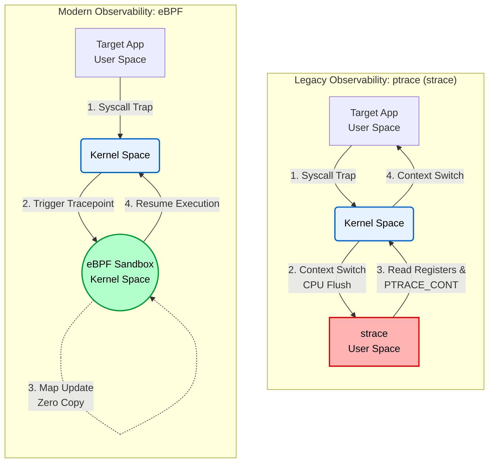

# 01. Observability: ptrace vs. eBPF (Context Switch Overhead Analysis)

## 📌 Objective
To quantify the user-kernel space Context Switch overhead caused by the traditional system call tracing tool (`strace`) and to prove the zero-overhead characteristics of in-kernel eBPF (CO-RE) based observability technology.

Specifically, this project validates an architecture that minimizes the runtime impact of monitoring systems in domains requiring high availability and real-time processing (e.g., defense systems, AI infrastructure).

## 🛠️ Test Environment & Target Workload
* **Target Workload:** A C program (`workload.c`) that sequentially creates and destroys processes (container isolation) 10,000 times using the `clone` system call.
* **Environment:** WSL2 (Kernel 5.15) with BTF (BPF Type Format) enabled, utilizing the CO-RE (Compile Once – Run Everywhere) approach.

## 📊 Benchmark Results (10,000 Iterations)

| Tracing Tool | Kernel CPU Time (`sys`) | Characteristics & Analysis |
| :--- | :---: | :--- |
| **Baseline** | 2.29s (Cold Start) | No tracing tool. Includes initial memory page allocation and CPU warm-up costs. |
| **strace** | **2.89s** | `ptrace` based. Induces a Context Switch per system call. A major cause of kernel bottlenecks. |
| **bpftrace** | **1.40s** | **eBPF based.** JIT compiled and executed within a kernel sandbox. Virtually zero overhead. |

## 💡 Engineering Conclusion
In the process of intercepting 10,000 system calls, `strace` consumed approximately `2.89 seconds` of kernel time, whereas `eBPF` consumed only `1.40 seconds`. This proves that by utilizing eBPF, we can build a kernel-level dynamic tracing and system observability network without degrading application performance.

## 🧠 Architecture Analysis: Why is ptrace so slow?


### 1. The Limitations of `ptrace` (The Context Switch Bottleneck)
`strace` operates on top of `ptrace`, the traditional system call used for debugging. 
Whenever a target process invokes a system call, the kernel generates a `SIGTRAP` to halt the execution state (`TASK_TRACED`) and wakes up the `strace` process in user space to hand over control. 
During this interception, **heavy Context Switches occur twice per system call, causing memory protection domain shifts and CPU cache/TLB flushes.** This architectural flaw is the fundamental reason why the total kernel CPU time (`sys`) spiked by over 1.8 times in our benchmark.

### 2. The `eBPF` Solution (In-Kernel JIT Execution)
In contrast, `eBPF` allows us to write observability logic in C and inject it directly into an in-kernel sandbox (virtual machine) where it is **JIT (Just-In-Time) compiled**. 
When the target process makes a system call, the tracing code executes immediately within the kernel space—eliminating the need to bounce back to user space **(Zero Context Switch)**. This mechanism enables safe, real-time dynamic tracing with virtually **zero overhead**, ensuring that production server performance remains completely unaffected.

<details>
<summary><b>Terminal Output</b></summary>
<div markdown="1">

```text
=== 1. C Program Build ===
Build completed.

=== 2. Baseline Measurement ===
[Target] Workload start (Iterations: 10000)
[Target] Workload end
real 4.77
user 2.14
sys 2.29

=== 3. strace Overhead Measurement ===
[Target] Workload start (Iterations: 10000)
[Target] Workload end
% time     seconds  usecs/call     calls    errors syscall
------ ----------- ----------- --------- --------- ----------------
 80.71    1.142722         114     10000           clone
 19.23    0.272305          27     10000           wait4
  0.01    0.000175          58         3           mprotect
  0.01    0.000117          58         2           write
  0.01    0.000103         103         1           set_tid_address
  0.01    0.000093          46         2           munmap
  0.01    0.000092          30         3           brk
  0.00    0.000052           5         9           mmap
  0.00    0.000045          15         3           fstat
  0.00    0.000045          45         1           getrandom
  0.00    0.000044          44         1           prlimit64
  0.00    0.000040          40         1           set_robust_list
  0.00    0.000040          40         1           rseq
  0.00    0.000000           0         1           read
  0.00    0.000000           0         2           close
  0.00    0.000000           0         2           pread64
  0.00    0.000000           0         1         1 access
  0.00    0.000000           0         1           execve
  0.00    0.000000           0         1           arch_prctl
  0.00    0.000000           0         2           openat
------ ----------- ----------- --------- --------- ----------------
100.00    1.415873          70     20037         1 total
real 3.69
user 0.91
sys 2.89

[Target] Workload start (Iterations: 10000)
[Target] Workload end
real 3.00
user 0.72
sys 1.40

=== Benchmarking Completed ===
```
