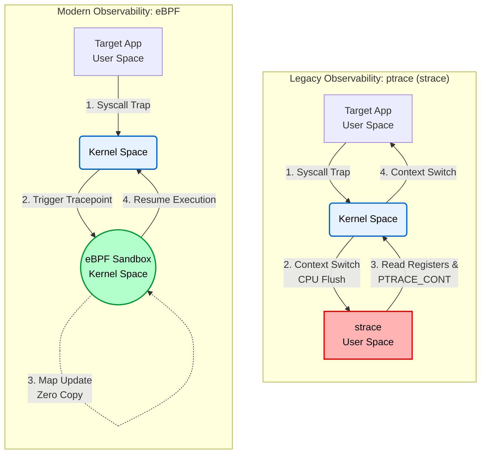

# 01. Observability: ptrace vs. eBPF (Context Switch Overhead Analysis)

## 📌 목표
전통적인 시스템 콜 추적 도구(strace)가 유발하는 유저-커널 스페이스 간의 Context Switch 오버헤드를 수치화해 보고, 커널 내부에서 실행되는 eBPF(CO-RE) 관측 기술이 어떻게 오버헤드를 최소화하는지 직접 테스트하며 학습하는 것을 목표로 합니다.

방산 체계나 AI 인프라처럼 높은 가용성과 실시간 처리가 필요한 환경에서 모니터링 도구가 시스템에 미치는 영향을 줄이는 아키텍처에 대해 깊이 고민해 보고자 진행한 실험입니다.

## 🛠️ Test Environment & Target Workload
* **Target Workload:** `clone` 시스템 콜을 사용하여 컨테이너 격리(프로세스 생성 및 소멸) 과정을 10,000회 반복하는 C 프로그램(`workload.c`)을 작성하여 부하를 발생시켰습니다.
* **Environment:** BTF(BPF Type Format)가 활성화된 WSL2 (Kernel 5.15) 환경에서 CO-RE(Compile Once – Run Everywhere) 메커니즘을 활용해 커널 헤더 의존성 없이 테스트를 진행했습니다.

## 📊 벤치마크 결과 (10,000 Iterations)

| Tracing Tool | Kernel CPU Time (`sys`) | Characteristics & Analysis |
| :--- | :---: | :--- |
| **Baseline** | 2.29s (Cold Start) | 관측 도구를 붙이지 않은 상태. 초기 메모리 페이지 할당 및 CPU 웜업 비용이 포함되어 있습니다. |
| **strace** | **2.89s** | `ptrace` 기반. 매 시스템 콜마다 Context Switch가 발생하여 커널 병목 현상이 일어나는 것을 직접 확인했습니다. |
| **bpftrace** | **1.40s** | **eBPF 기반.** 커널 샌드박스 내부에서 JIT 컴파일 및 실행되어 오버헤드가 사실상 제로에 가까움을 확인했습니다. |

## 💡 결론  
1만 번의 시스템 콜을 가로채는 실험 결과, strace는 약 2.89초의 커널 시간(sys)을 소모한 반면, eBPF는 1.40초만을 소모했습니다.

이 테스트를 통해 애플리케이션의 런타임 성능을 깎아먹지 않고 커널 레벨의 동적 추적(Dynamic Tracing)을 수행하려면 eBPF와 같은 기술의 도입이 중요하다는 점을 배웠습니다.

## 🧠 아키텍처 분석: 왜 ptrace는 느린가?


### 1. ptrace의 한계 (Context Switch 병목 현상 이해)
strace는 전통적인 디버깅 시스템 콜인 ptrace를 기반으로 동작합니다. 타겟 프로세스가 시스템 콜을 호출할 때마다 커널은 SIGTRAP을 발생시켜 프로세스 실행을 멈추고(TASK_TRACED), 유저 스페이스의 strace 프로세스를 깨워 제어권을 넘깁니다.

이 과정을 추적해 보며, 매 시스템 콜마다 메모리 보호 영역이 변경되고 CPU 캐시/TLB가 플러시(Flush)되는 무거운 Context Switch가 2회씩 발생한다는 것을 알 수 있었습니다. 벤치마크에서 커널 CPU 시간(sys)이 1.8배 이상 폭증한 것도 바로 이 구조적 한계 때문임을 확인했습니다.

### 2. eBPF의 해결책 (커널 내부 JIT 컴파일 및 실행)
반면 eBPF는 관측 로직을 C로 작성한 뒤, 커널 내부의 샌드박스(가상 머신)로 안전하게 주입하여 JIT(Just-In-Time) 컴파일하는 방식을 사용합니다.

타겟 프로세스가 시스템 콜을 호출하면 유저 스페이스로 돌아갈 필요 없이 커널 공간 내부에서 즉각적으로 관측 코드가 실행(Zero Context Switch)됩니다. 이번 실험을 통해, 운영 서버의 성능에 거의 영향을 주지 않으면서도 실시간 모니터링을 구현할 수 있는 eBPF의 동작 메커니즘을 깊이 이해할 수 있었습니다.

<details>
<summary><b>터미널 출력</b></summary>
<div markdown="1">

```text
=== 1. C Program Build ===
Build completed.

=== 2. Baseline Measurement ===
[Target] Workload start (Iterations: 10000)
[Target] Workload end
real 4.77
user 2.14
sys 2.29

=== 3. strace Overhead Measurement ===
[Target] Workload start (Iterations: 10000)
[Target] Workload end
% time     seconds  usecs/call     calls    errors syscall
------ ----------- ----------- --------- --------- ----------------
 80.71    1.142722         114     10000           clone
 19.23    0.272305          27     10000           wait4
  0.01    0.000175          58         3           mprotect
  0.01    0.000117          58         2           write
  0.01    0.000103         103         1           set_tid_address
  0.01    0.000093          46         2           munmap
  0.01    0.000092          30         3           brk
  0.00    0.000052           5         9           mmap
  0.00    0.000045          15         3           fstat
  0.00    0.000045          45         1           getrandom
  0.00    0.000044          44         1           prlimit64
  0.00    0.000040          40         1           set_robust_list
  0.00    0.000040          40         1           rseq
  0.00    0.000000           0         1           read
  0.00    0.000000           0         2           close
  0.00    0.000000           0         2           pread64
  0.00    0.000000           0         1         1 access
  0.00    0.000000           0         1           execve
  0.00    0.000000           0         1           arch_prctl
  0.00    0.000000           0         2           openat
------ ----------- ----------- --------- --------- ----------------
100.00    1.415873          70     20037         1 total
real 3.69
user 0.91
sys 2.89

[Target] Workload start (Iterations: 10000)
[Target] Workload end
real 3.00
user 0.72
sys 1.40

=== Benchmarking Completed ===
```
