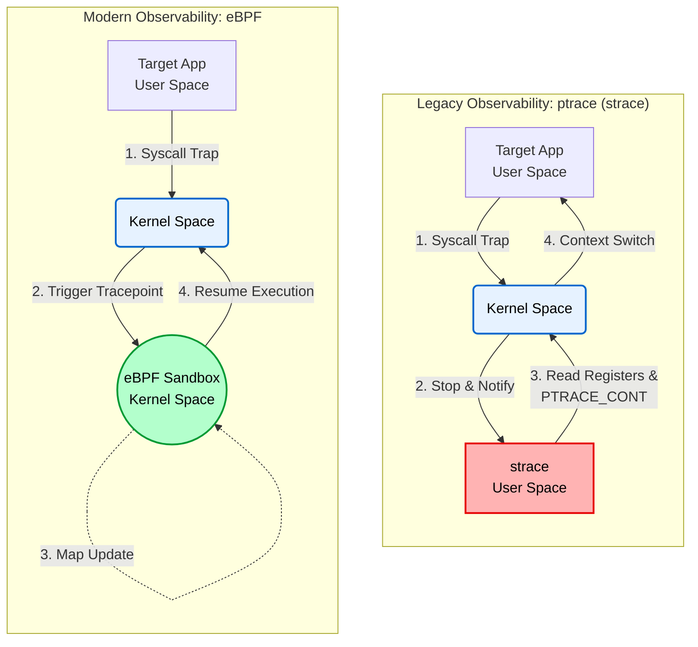

# 01. Observability: ptrace vs. eBPF (Context Switch Overhead Analysis)

## 📌 목표
전통적인 시스템 콜 추적 도구인 `strace`가 유발하는 유저·커널 간 전환 비용을 정량화하고, 커널 내부에서 실행되는 eBPF 기반 관측 방식과 비교하는 것을 목표로 한다.

고가용성과 낮은 지연이 요구되는 환경에서 관측 도구 자체가 워크로드에 미치는 교란을 최소화할 필요가 있다. 본 실험은 서로 다른 추적 구조가 커널 CPU 시간에 미치는 영향을 비교한다.

## 🛠️ Test Environment & Target Workload
* **Target Workload:** `clone` 시스템 콜로 프로세스 생성·소멸을 10,000회 반복하는 C 프로그램(`workload.c`)을 사용한다.
* **Environment:** BTF(BPF Type Format)가 활성화된 WSL2(Linux 5.15) 환경에서 CO-RE(Compile Once – Run Everywhere) 기반 eBPF 추적을 수행한다.

## 📊 벤치마크 결과 (10,000 Iterations)

| Tracing Tool | Kernel CPU Time (`sys`) | Characteristics & Analysis |
| :--- | :---: | :--- |
| **Baseline** | 2.29s (Cold Start) | 관측 도구를 부착하지 않은 상태이며, 초기 메모리 페이지 할당과 CPU 웜업 비용을 포함한다. |
| **strace** | **2.89s** | `ptrace` 기반으로, 각 시스템 콜 진입·복귀 시 피추적 프로세스를 중단하고 추적 프로세스에 제어를 전달한다. |
| **bpftrace** | **1.40s** | eBPF 프로그램을 커널 내부에서 실행하여 현재 실험의 `strace` 대비 낮은 커널 CPU 시간을 보인다. |

## 💡 결론  
10,000회의 `clone`·`wait4` 호출을 추적한 결과, `strace`는 2.89초의 커널 시간(`sys`)을, eBPF는 1.40초를 기록한다.

다만 Baseline이 Cold Start 1회 측정이고 반복 횟수와 분산이 제시되지 않았으므로, 1.40초를 무관측 오버헤드보다 낮은 절대 비용으로 해석하거나 eBPF의 오버헤드가 0이라고 단정할 수는 없다. 본 결과는 해당 조건에서 커널 내 추적이 `ptrace` 기반 추적보다 작은 교란을 보였다는 사례로 해석한다.

## 🧠 아키텍처 분석: 왜 ptrace는 느린가?


### 1. ptrace의 한계 (Context Switch 병목 현상 이해)
`strace`는 `ptrace` 인터페이스를 기반으로 동작한다. 피추적 프로세스가 시스템 콜에 진입하거나 복귀할 때 커널은 해당 프로세스를 정지하고, 유저 공간의 추적 프로세스가 레지스터와 이벤트를 검사한 뒤 실행을 재개하도록 한다.

이 구조는 시스템 콜마다 추적 프로세스의 스케줄링과 상태 검사를 추가한다. 단, 모든 스위치에서 TLB 전체가 항상 플러시된다고 보기는 어렵다. PCID/ASID 지원, 커널 버전, 하드웨어에 따라 주소 변환 캐시의 보존 방식이 달라지기 때문이다.

### 2. eBPF의 해결책 (커널 내부 JIT 컴파일 및 실행)
반면 eBPF는 검증기가 안전성을 확인한 프로그램을 커널 내 eBPF 런타임에서 실행하며, 환경에 따라 JIT 컴파일을 적용한다.

트레이스포인트가 발생하면 관측 코드가 커널 컨텍스트에서 실행되므로, 각 이벤트를 처리하기 위해 별도의 유저 공간 추적 프로세스로 제어를 넘길 필요가 없다. 이 차이가 본 실험에서 관측된 `strace` 대비 비용 감소를 설명한다.

<details>
<summary><b>터미널 출력</b></summary>
<div markdown="1">

```text
=== 1. C Program Build ===
Build completed.

=== 2. Baseline Measurement ===
[Target] Workload start (Iterations: 10000)
[Target] Workload end
real 4.77
user 2.14
sys 2.29

=== 3. strace Overhead Measurement ===
[Target] Workload start (Iterations: 10000)
[Target] Workload end
% time     seconds  usecs/call     calls    errors syscall
------ ----------- ----------- --------- --------- ----------------
 80.71    1.142722         114     10000           clone
 19.23    0.272305          27     10000           wait4
  0.01    0.000175          58         3           mprotect
  0.01    0.000117          58         2           write
  0.01    0.000103         103         1           set_tid_address
  0.01    0.000093          46         2           munmap
  0.01    0.000092          30         3           brk
  0.00    0.000052           5         9           mmap
  0.00    0.000045          15         3           fstat
  0.00    0.000045          45         1           getrandom
  0.00    0.000044          44         1           prlimit64
  0.00    0.000040          40         1           set_robust_list
  0.00    0.000040          40         1           rseq
  0.00    0.000000           0         1           read
  0.00    0.000000           0         2           close
  0.00    0.000000           0         2           pread64
  0.00    0.000000           0         1         1 access
  0.00    0.000000           0         1           execve
  0.00    0.000000           0         1           arch_prctl
  0.00    0.000000           0         2           openat
------ ----------- ----------- --------- --------- ----------------
100.00    1.415873          70     20037         1 total
real 3.69
user 0.91
sys 2.89

[Target] Workload start (Iterations: 10000)
[Target] Workload end
real 3.00
user 0.72
sys 1.40

=== Benchmarking Completed ===
```

</div>
</details>
