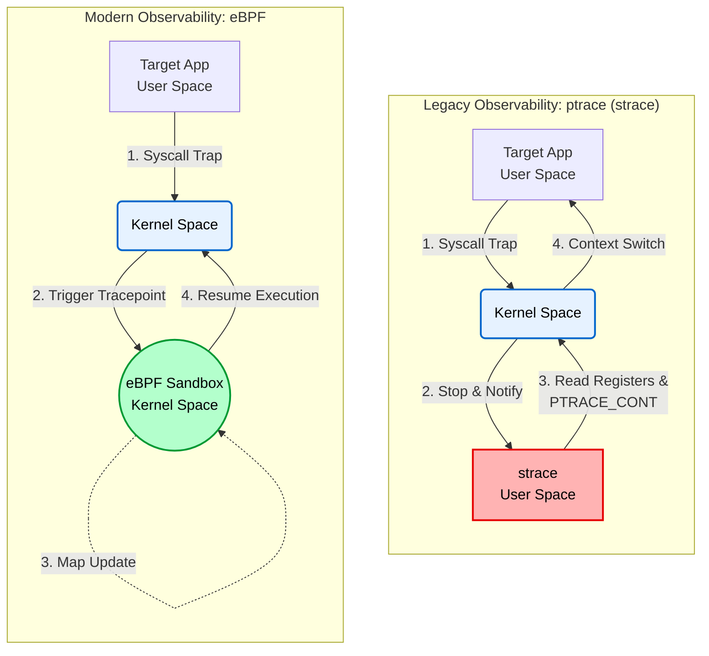

# 01. Observability: ptrace vs. eBPF (Context Switch Overhead Analysis)

## 📌 Objective
This experiment quantifies the user–kernel transition costs introduced by the traditional system-call tracer `strace` and compares them with an eBPF-based tracing mechanism that executes inside the kernel.

Observability tools should minimize their own perturbation of workloads in high-availability and latency-sensitive environments. The experiment compares how two tracing architectures affect kernel CPU time.

## 🛠️ Test Environment & Target Workload
* **Target Workload:** A C program (`workload.c`) that sequentially creates and destroys processes (container isolation) 10,000 times using the `clone` system call.
* **Environment:** WSL2 (Kernel 5.15) with BTF (BPF Type Format) enabled, utilizing the CO-RE (Compile Once – Run Everywhere) approach.

## 📊 Benchmark Results (10,000 Iterations)

| Tracing Tool | Kernel CPU Time (`sys`) | Characteristics & Analysis |
| :--- | :---: | :--- |
| **Baseline** | 2.29s (Cold Start) | No tracing tool is attached; the result includes initial page allocation and CPU warm-up costs. |
| **strace** | **2.89s** | Based on `ptrace`; it stops the tracee and transfers control to the tracer at system-call entry and exit. |
| **bpftrace** | **1.40s** | Executes an eBPF program inside the kernel and records less kernel CPU time than `strace` in this experiment. |

## 💡 Conclusion
While tracing 10,000 `clone` and `wait4` calls, `strace` recorded 2.89 seconds of kernel time (`sys`), whereas eBPF recorded 1.40 seconds.

The Baseline is a single cold-start measurement, and neither repeated trials nor variance are reported. Consequently, the 1.40-second result cannot be interpreted as an absolute cost below the uninstrumented workload, nor does it establish zero eBPF overhead. It shows that in-kernel tracing caused less perturbation than `ptrace`-based tracing under the tested conditions.

## 🧠 Architecture Analysis: Why is ptrace so slow?


### 1. Limitations of `ptrace`
`strace` operates through the `ptrace` interface. At system-call entry and exit, the kernel stops the tracee so that the user-space tracer can inspect registers and events before resuming execution.

This design adds tracer scheduling and state inspection to each system call. It does not, however, imply that every switch flushes the entire TLB: preservation behavior depends on PCID/ASID support, the kernel, and the hardware.

### 2. eBPF In-Kernel Execution
The eBPF verifier checks a program before the kernel executes it in the eBPF runtime; the kernel may apply JIT compilation when supported and enabled.

When a tracepoint fires, the tracing code runs in kernel context. Processing each event therefore does not require transferring control to a separate user-space tracer. This difference explains the lower cost observed relative to `strace` in this experiment.

<details>
<summary><b>Terminal Output</b></summary>
<div markdown="1">

```text
=== 1. C Program Build ===
Build completed.

=== 2. Baseline Measurement ===
[Target] Workload start (Iterations: 10000)
[Target] Workload end
real 4.77
user 2.14
sys 2.29

=== 3. strace Overhead Measurement ===
[Target] Workload start (Iterations: 10000)
[Target] Workload end
% time     seconds  usecs/call     calls    errors syscall
------ ----------- ----------- --------- --------- ----------------
 80.71    1.142722         114     10000           clone
 19.23    0.272305          27     10000           wait4
  0.01    0.000175          58         3           mprotect
  0.01    0.000117          58         2           write
  0.01    0.000103         103         1           set_tid_address
  0.01    0.000093          46         2           munmap
  0.01    0.000092          30         3           brk
  0.00    0.000052           5         9           mmap
  0.00    0.000045          15         3           fstat
  0.00    0.000045          45         1           getrandom
  0.00    0.000044          44         1           prlimit64
  0.00    0.000040          40         1           set_robust_list
  0.00    0.000040          40         1           rseq
  0.00    0.000000           0         1           read
  0.00    0.000000           0         2           close
  0.00    0.000000           0         2           pread64
  0.00    0.000000           0         1         1 access
  0.00    0.000000           0         1           execve
  0.00    0.000000           0         1           arch_prctl
  0.00    0.000000           0         2           openat
------ ----------- ----------- --------- --------- ----------------
100.00    1.415873          70     20037         1 total
real 3.69
user 0.91
sys 2.89

[Target] Workload start (Iterations: 10000)
[Target] Workload end
real 3.00
user 0.72
sys 1.40

=== Benchmarking Completed ===
```

</div>
</details>
