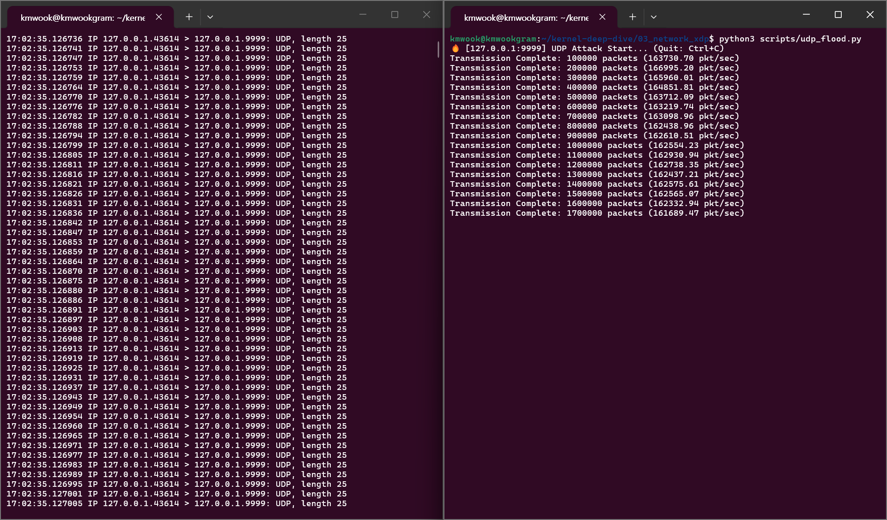
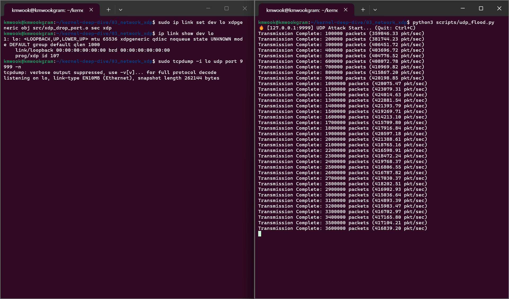

# 03. Networking: XDP (eXpress Data Path) Zero-copy Firewall

## 📌 목표
전통적인 리눅스 네트워크 스택의 구조적 병목(`sk_buff` 메모리 할당 및 스택 통과 오버헤드)을 분석하고, 이를 우회(OS Bypass)하여 하드웨어(NIC) 드라이버 레벨에서 패킷을 처리하는 **XDP(eXpress Data Path)** 기술의 성능을 확인합니다.

특정 포트를 타겟으로 하는 대규모 UDP Flood (DDoS) 공격을 가정하고, 커널 자원 소모 없이 패킷을 즉각 폐기(XDP_DROP)하는 초고속 방화벽을 구현했습니다.

## 🛠️ Test Environment & Target Workload
* **Target Workload:** 파이썬 `socket` 라이브러리를 활용하여 로컬 루프백(`127.0.0.1`)의 9999번 포트로 초당 수십만 개의 UDP 패킷을 쏟아붓는 DDoS 시뮬레이션 스크립트 (`udp_flood.py`).
* **Defense & Observability Tools:** C언어로 작성된 eBPF/XDP 프로그램 (`xdp_drop_port.c`): 9999번 포트 패킷 식별 및 `XDP_DROP` 수행.
  * `tcpdump`: 커널 네트워크 스택(AF_PACKET) 레벨에서의 패킷 도달 여부 관측.

## 📊 1. Baseline: 전통적인 커널 네트워크 스택의 한계 (방어막 부재)
XDP 방어막이 없는 상태에서 대규모 UDP 패킷 공격을 수행하고 성능을 측정했습니다.

* **관측 결과 (`tcpdump`):** 커널 스택으로 모든 패킷이 유입되어 엄청난 양의 로그가 출력됨.
* **처리 성능 (Attacker Throughput):** 초당 약 **200,000 ~ 300,000 pkt/sec** 도달.
* **병목 원인 분석:** 루프백 테스트 환경이므로 공격자(Python)와 방어자(커널)가 CPU를 공유합니다. 커널이 쏟아지는 패킷마다 거대한 `sk_buff` 구조체를 메모리에 할당(Copy)하고 IP/UDP 스택을 거치는 무거운 연산을 수행하느라 CPU 자원이 고갈되었습니다. 이로 인해 시스템 전체의 성능이 저하되며, 역설적으로 공격 스크립트의 패킷 전송 속도마저 제한되는 현상을 확인했습니다.

## 📊 2. XDP Defense: 드라이버 레벨 패킷 요격 (Zero-copy & OS Bypass)
NIC 드라이버 레벨(`xdpgeneric` on `lo`)에 eBPF 바이트코드를 주입하여 9999번 포트 UDP 패킷을 커널 진입 전에 즉시 드랍(`XDP_DROP`)하도록 설정했습니다.

* **관측 결과 (`tcpdump`):** 초당 수십만 개의 패킷이 쏟아짐에도 불구하고 **`tcpdump`에는 단 한 줄의 패킷 로그도 찍히지 않는 결과**를 확인했습니다. 패킷이 커널 네트워크 스택에 도달하기 전에 최하단에서 드랍되었음(OS Bypass)을 의미합니다.
* **처리 성능 (Attacker Throughput):** 초당 약 **610,000 ~ 620,000 pkt/sec** 도달 (**성능 2배 이상 폭증**).

## 💡 결론
이 실험을 통해 현대 고성능 시스템 아키텍처에서 **Zero-copy와 OS Bypass**가 가지는 위력을 확인했습니다.

1. **커널 보호 및 리소스 보존 (Resource Exhaustion 방어)**

   XDP를 적용하자 패킷 처리량(공격 속도)이 30만 개에서 61만 개로 2배 이상 폭증했습니다. 이는 패킷 처리 최전선에서 메모리 할당(`sk_buff`)과 스택 오버헤드를 제거함으로써 CPU 자원 소모를 줄였기 때문입니다. 결과적으로 여유로워진 CPU 자원을 공격 스크립트가 차지하여 속도가 빨라진 것입니다.
   
2. **미션 크리티컬 시스템을 위한 차세대 보안/네트워킹 아키텍처**

   방산, 금융(HFT), 대규모 클라우드 인프라 앞단에 XDP 기반의 필터링을 구축하면, 악의적인 대규모 트래픽(DDoS)이 유입되더라도 서버의 백엔드 애플리케이션과 커널은 전혀 부하를 느끼지 않고(0% CPU 점유) 정상적인 클라이언트의 요청만을 온전히 처리할 수 있을 것입니다.
