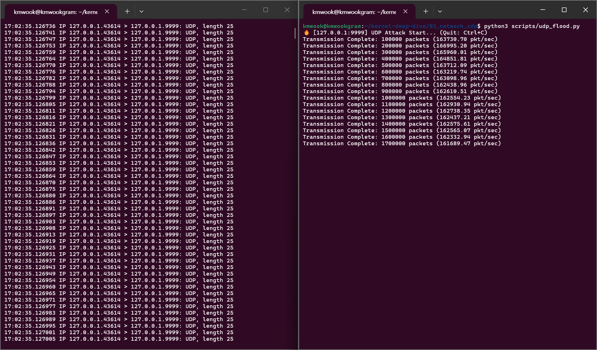
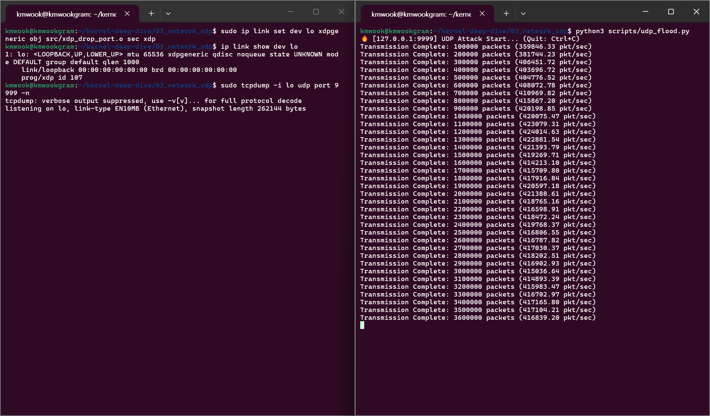

# 03. Networking: Early Packet Drop with Generic XDP

## 📌 Objective
This experiment analyzes the cost of `sk_buff` allocation and upper-layer traversal in the traditional Linux network stack and evaluates the effect of filtering packets at an earlier XDP (eXpress Data Path) hook.

It generates a UDP flood toward a specific port and implements a filter that returns `XDP_DROP` for matching packets.

## 🛠️ Test Environment & Target Workload
* **Target Workload:** A Python `socket` script (`udp_flood.py`) that continuously sends UDP packets to port 9999 on the loopback address (`127.0.0.1`).
* **Defense & Observability Tools:** A C eBPF/XDP program (`xdp_drop_port.c`) that returns `XDP_DROP` for UDP packets targeting port 9999.
  * `tcpdump`: Observes packet arrival at the kernel network stack (AF_PACKET) level.

## 📊 1. Baseline: Traditional Kernel Network Path
UDP packets are transmitted and throughput is measured without an XDP program attached.

* **Observation (`tcpdump`):** Packets reach the AF_PACKET observation point and appear in the capture log.
* **Sender Throughput:** Approximately **200,000–300,000 pkt/s**.
* **Analysis:** In a loopback test, the sender and kernel network path share CPU resources on the same host. Without XDP, packets traverse the `sk_buff`-based IP/UDP path and the AF_PACKET observation point, so this processing cost also affects sender throughput.

## 📊 2. XDP Defense: Drop Before the Upper Network Stack
The eBPF program is attached to the loopback interface in generic XDP mode (`xdpgeneric`) and returns `XDP_DROP` for UDP packets targeting port 9999. Generic XDP runs in the kernel's generic receive path, not in a native NIC-driver path.

* **Observation (`tcpdump`):** No packet log is observed, showing that matching packets are dropped at the XDP hook before reaching the AF_PACKET tap.
* **Sender Throughput:** Approximately **610,000–620,000 pkt/s**, or about 2.0–3.1 times the Baseline range.

## 💡 Conclusion
The XDP filter prevents matching packets from entering the upper network stack. Under the same loopback conditions, sender throughput increases from 200,000–300,000 pkt/s to 610,000–620,000 pkt/s.

1. **Early Drop and Resource Conservation**
   
   The XDP hook prevents matching packets from traversing the `sk_buff`-based upper stack. Reducing this work on a loopback interface leaves more CPU time for the sender, so increased sender throughput indicates a cheaper early-drop path rather than weaker filtering.
   
2. **Scope and Further Evaluation**
   
   XDP can reduce load on upper layers and applications by discarding unwanted packets early. This experiment, however, is a microbenchmark using generic XDP on `lo` and a single sender. It does not directly establish native/driver-XDP performance or CPU utilization under DDoS traffic. Follow-up work should measure throughput, packet size, CPU utilization, and drop rate on a physical NIC.
