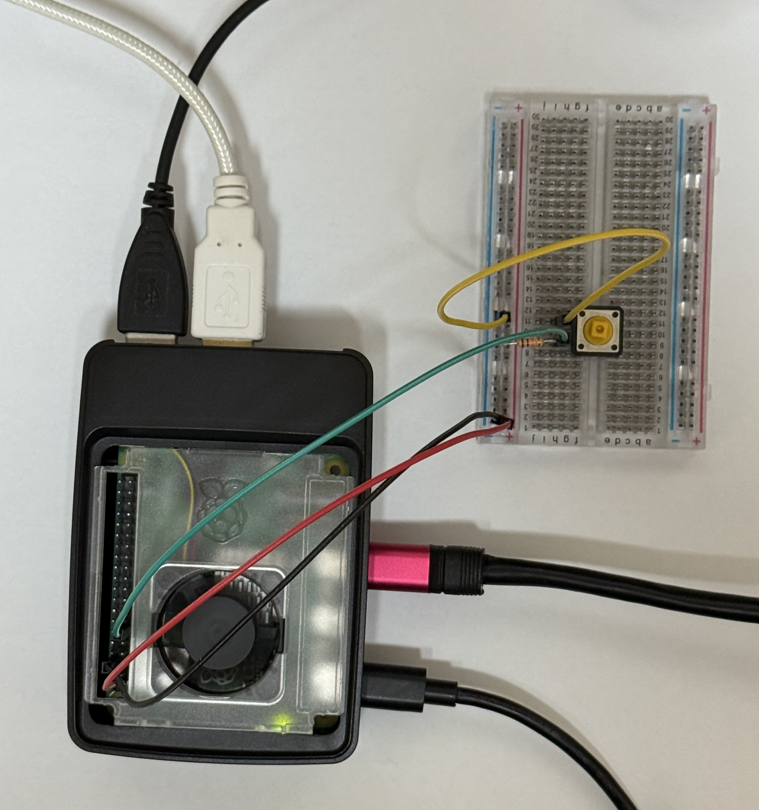
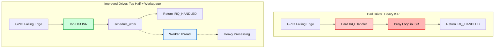

# 04. Interrupt Handling: Low-Latency Device Driver Design

## 📌 목표
이 단계에서는 리눅스 디바이스 드라이버가 인터럽트 처리를 Top Half와 Bottom Half로 분리하는 구조적 이유를 분석합니다.

하드웨어 인터럽트가 발생하면 CPU는 실행 중인 작업을 즉시 중단하고 인터럽트 서비스 루틴(ISR)에 진입합니다. 이 때 만약 ISR 내부에서 무거운 작업을 직접 수행하면 하드 인터럽트 컨텍스트를 너무 오래 점유하게 되어 다른 인터럽트 처리가 지연되고 시스템 전체의 불안정을 초래할 수 있습니다.

본 실험의 목적은 Raspberry Pi 5 하드웨어 환경에서 실제 측정을 통해, 오래 걸리는 작업을 ISR에서 분리하여 **Workqueue 기반의 지연 실행(Deferred execution) 경로** 로 넘겼을 때 인터럽트 핸들러 내 체류 시간이 얼마나 감소하는지 관측하는 것입니다.

## 🛠️ 테스트 환경 & 타겟 워크로드
* **Hardware:** Raspberry Pi 5 Model B Rev 1.0
* **OS / Kernel:** Raspberry Pi OS, Linux `6.18.34+rpt-rpi-2712` (`aarch64`)
* **Interrupt Source:** custom Device Tree overlay (`irq.dtbo`)를 통해 등록된 GPIO 17 button input
  
* **Device Driver Variants:**
  * `bad_irq.ko`: ISR 내부에서 의도적으로 무거운 Busy loop를 실행하는 드라이버.
  * `workqueue_irq.ko`: 동일한 Busy loop를 리눅스 Workqueue를 통해 스케줄링하는 드라이버.
* **Observability Tool:** `irq:irq_handler_entry` 부터 `irq:irq_handler_exit` 까지의 소요 시간을 측정하는 BCC/eBPF tracepoint program.

## 🧪 실험 설계
본 실험은 동일한 Device Tree 호환 문자열인 `kmwook,irq`에 바인딩된 두 드라이버를 비교합니다. 두 모듈은 같은 플랫폼 디바이스를 타겟으로 하므로 한 번에 하나씩만 로드하여 테스트를 진행했습니다.

1. `bad_irq.ko`를 로드하고 IRQ 185가 ISR 내부에 머무는 시간 측정
2. `bad_irq.ko` 제거
3. `workqueue_irq.ko`를 로드하고 동일한 IRQ 재측정
4. 관측된 Top Half 실행 시간 비교

eBPF tracing 코드는 지연된 작업(Deferred work)의 전체 완료 시간을 측정하지 않습니다. 저지연 드라이버 설계에서 짧게 유지되어야 하는 핵심 경로인 하드 IRQ 핸들러 자체의 실행 시간만을 특정하여 측정합니다.

## 📊 1. Baseline: ISR 내부에서의 무거운 처리 (`bad_irq`)
의도적으로 잘못 설계된 구현에서는 IRQ 핸들러가 인터럽트 컨텍스트 내에서 긴 Busy loop를 직접 실행합니다.

```c
static irqreturn_t bad_irq_handler(int irq, void *dev_id)
{
    volatile unsigned long i;
    for (i = 0; i < busy_counter; i++)
        cpu_relax();

    return IRQ_HANDLED;
}
```

### 측정 결과
```text
IRQ Duration (ns)
118507067
118504325
118492011
164633734
118506046
118497045
```

물리적 버튼을 4번 눌렀음에도 6번의 인터럽트 이벤트가 관측되었습니다. 이는 기계식 버튼의 접점 바운스(Contact bounce)로 인해 여러 번의 하강 에지(Falling edge)가 발생할 수 있으므로 예상 가능한 결과입니다.

| Sample | IRQ Handler Duration |
| :---: | :---: |
| 1 | 118.51 ms |
| 2 | 118.50 ms |
| 3 | 118.49 ms |
| 4 | 164.63 ms |
| 5 | 118.51 ms |
| 6 | 118.50 ms |
| **Average** | **126.19 ms** |

### 분석
ISR은 약 118ms에서 165ms 동안 활성화 상태를 유지했습니다. 이는 하드 인터럽트 컨텍스트 기준으로 매우 긴 시간입니다.

이 시간 동안 CPU는 이벤트를 빠르게 확인하고 정상적인 스케줄링으로 복귀하는 대신, 인터럽트 핸들러에 의해 점유됩니다. 실제 하드웨어 환경에서 이러한 설계는 다른 인터럽트를 지연시키고 꼬리 지연 시간(Tail latency)을 증가시키며, 인터럽트 폭주 시 시스템 전체의 불안정성을 초래할 위험이 있습니다.

## 📊 2. Deferred Work: Workqueue 기반 Bottom Half (`workqueue_irq`)
개선된 구현에서는 ISR이 작업만 스케줄링하고 즉시 반환(Return)합니다.

```c
static irqreturn_t workqueue_irq_handler(int irq, void *dev_id)
{
    struct workqueue_irq_dev *priv = dev_id;

    if (!schedule_work(&priv->work))
        pr_debug("work already pending\n");
    return IRQ_HANDLED;
}
```

무거운 Busy loop 연산은 여전히 존재하지만, 이후 프로세스 컨텍스트의 Workqueue를 통해 실행됩니다.

```c
static void work_handler(struct work_struct *work)
{
    volatile unsigned long i;
    for (i = 0; i < busy_counter; i++)
        cpu_relax();
}
```

### 측정 결과
```text
IRQ Duration (ns)
3333
5610
3463
352
1019
3871
1462
```

| Driver | Top Half Duration |
| :---: | :---: |
| `bad_irq.ko` average | 126.19 ms |
| `workqueue_irq.ko` average | 2.73 us |

| Sample | IRQ Handler Duration |
| :---: | :---: |
| 1 | 3.333 us |
| 2 | 5.610 us |
| 3 | 3.463 us |
| 4 | 0.352 us |
| 5 | 1.019 us |
| 6 | 3.871 us |
| 7 | 1.462 us |
| **Average** | **2.73 us** |

Workqueue 기반 설계는 평균 bad_irq 결과와 비교하여 관측된 IRQ 핸들러 실행 시간을 약 46,000배 감소시켰습니다.

## 🧠 아키텍처 분석: Workqueue가 결과를 바꾼 이유


### 1. The Problem: 긴 ISR 실행 시간
인터럽트 핸들러는 일반적인 커널 작업이 다수 제한되는 특수한 컨텍스트에서 실행됩니다. 따라서 하드웨어 이벤트를 인지하고 최소한의 상태만 저장한 뒤, 필요한 경우 후속 작업을 스케줄링하고 최대한 빨리 반환하는 것이 원칙입니다.

그러나 `bad_irq` 드라이버는 ISR 내부에서 비용이 큰 루프를 직접 실행하여 이 원칙을 위반했습니다. 측정 결과에서 나타나듯 이로 인해 Top Half 실행 시간이 수백 밀리초 단위로 늘어났습니다.

또한 ISR이 실행되는 동안 해당 CPU 코어의 로컬 인터럽트가 비활성화되므로, 네트워크 패킷이나 타이머 틱과 같은 중요한 하드웨어 이벤트가 무시되거나 심각하게 지연될 수 있습니다.

### 2. The Solution: Deferred Work
`workqueue_irq` 드라이버는 무거운 연산을 지연된 작업으로 전환합니다.

ISR은 더 이상 비용이 큰 연산을 직접 수행하지 않고, `schedule_work()`를 호출하고 몇 마이크로초 내에 반환하며, 나머지 느린 경로는 커널 워커 스레드(Worker thread)가 나중에 처리하도록 위임합니다.

이것이 Top Half / Bottom Half 인터럽트 처리의 핵심 설계 원칙입니다. 긴급한 경로는 짧게 유지하고, 긴급하지 않은 처리는 더 안전한 실행 컨텍스트로 이동시킵니다.

## 🔭 한계점 및 향후 과제
본 실험은 무거운 ISR 설계와 Workqueue 기반 지연(Deferred) 설계의 차이를 성공적으로 입증했으나, 몇 가지 한계점이 존재합니다.

1. **기계식 버튼의 접점 바운스 (Mechanical Button Bounce)**

   인터럽트 소스로 GPIO 17에 연결된 물리적 버튼을 사용했습니다. 기계식 스위치는 한 번의 누름에도 여러 번의 하강 에지(Falling edge)를 발생시킬 수 있기 때문에, 물리적인 버튼 조작 횟수보다 관측된 IRQ 이벤트 횟수가 더 많았습니다. 아키텍처의 차이를 증명하는 데는 무리가 없으나, 향후 실험에서는 GPIO 펄스 발생기, 마이크로컨트롤러 또는 하드웨어 디바운싱 회로와 같은 더 통제된 신호원을 사용해야 합니다.

2. **Top Half 측정의 한계**

   현재 작성된 eBPF 프로그램은 irq_handler_entry와 irq_handler_exit 사이의 소요 시간만 측정합니다. 즉, ISR이 실행되는 시간은 포착하지만, 지연된 Workqueue 작업이 실제로 언제 시작되고 언제 끝나는지는 측정하지 않습니다. 향후 버전에서는 Workqueue 이벤트를 추적하거나 work_handler() 내부에 커널 타임스탬프를 추가하여, 인터럽트 도달부터 지연된 작업 완료까지의 전체(End-to-End) 지연 시간을 측정할 것입니다.

3. **단일 GPIO 기반 시나리오**

   본 실험은 단순한 GPIO 인터럽트를 대상으로 진행되었습니다. 그러나 실제 프로덕션 환경의 드라이버는 DMA 완료, 네트워크 RX/TX 이벤트, 스토리지 인터럽트 또는 고주파수 센서 스트림 등을 처리합니다. 향후 연구에서는 더 높은 인터럽트 발생률과 현실적인 하드웨어 워크로드를 적용하여 Top Half / Bottom Half 비교 실험을 반복 수행할 필요가 있습니다.

4. **Workqueue가 유일한 정답은 아님**

   Workqueue는 프로세스 컨텍스트에서 실행되고 슬립(Sleep)이 가능하다는 장점이 있지만, 지연 시간을 최소화해야 하는 상황에서 항상 최고의 Bottom Half 메커니즘인 것은 아닙니다. 향후에는 각 디바이스 클래스에 적합한 설계가 무엇인지 이해하기 위해 Workqueue, Tasklet, SoftIRQ, Threaded IRQ, 그리고 NAPI 스타일의 폴링(Polling) 방식을 비교하는 실험이 필요합니다.

5. **실시간(Real-Time) 커널 튜닝**

   본 실험은 표준 라즈베리파이 OS 커널에서 수행되었습니다. 더 엄격한 지연 시간 보장이 필요한 환경을 위해, 향후에는 PREEMPT_RT 패치가 적용된 커널에서 동일한 드라이버 설계를 평가하고, CPU 격리(Isolation), IRQ 친화도(Affinity), 스레드 우선순위 및 스케줄러 정책이 ISR 지연과 지연된 작업(Deferred work) 지연에 각각 어떠한 영향을 미치는지 측정해 보아야 합니다.


## 💡 결론
본 실험을 통해 리눅스 디바이스 드라이버가 인터럽트 핸들러 내부에서 무거운 작업을 수행하지 않아야 하는 이유를 데이터를 통해 확인했습니다.

의도적으로 무겁게 설계된 ISR은 평균 126.19 ms 동안 IRQ 핸들러 내에 CPU를 점유했으나, Workqueue 기반 설계는 측정된 Top Half 소요 시간을 평균 2.73 us로 감소시켰습니다. 수행해야 할 작업 자체가 사라진 것은 아니며, 하드 인터럽트 컨텍스트에서 벗어나 중요한 인터럽트 경로를 차단하지 않는 워커 스레드로 이동하여 처리된 것입니다.

고가용성 및 실시간성을 지향하는 시스템에서는 이러한 구분이 필수적입니다. 기능적으로 정상 작동하는 것처럼 보이는 드라이버라도 ISR에서 장시간 실행되는 연산을 수행한다면 아키텍처 관점에서 위험할 수 있습니다.
짧은 Top Half와 지연된 Bottom Half 구조로 드라이버를 설계함으로써, 인터럽트 지연을 줄이고 시스템 응답성을 개선하며 하드웨어 제어 시스템을 위한 더 안전한 기반을 구축할 수 있습니다.

<details>
<summary><b>Terminal Output</b></summary>
<div markdown="1">

```text
kmwook@raspberrypi:~/kernel-deep-dive/04_driver_interrupt/irq_latency $ sudo python3 irq_latency.py 185
IRQ Duration (ns)
118507067
118504325
118492011
164633734
118506046
118497045
```

```text
kmwook@raspberrypi:~/kernel-deep-dive/04_driver_interrupt/irq_latency $ sudo python3 irq_latency.py 185
IRQ Duration (ns)
3333
5610
3463
352
1019
3871
1462
```

</div>
</details>
