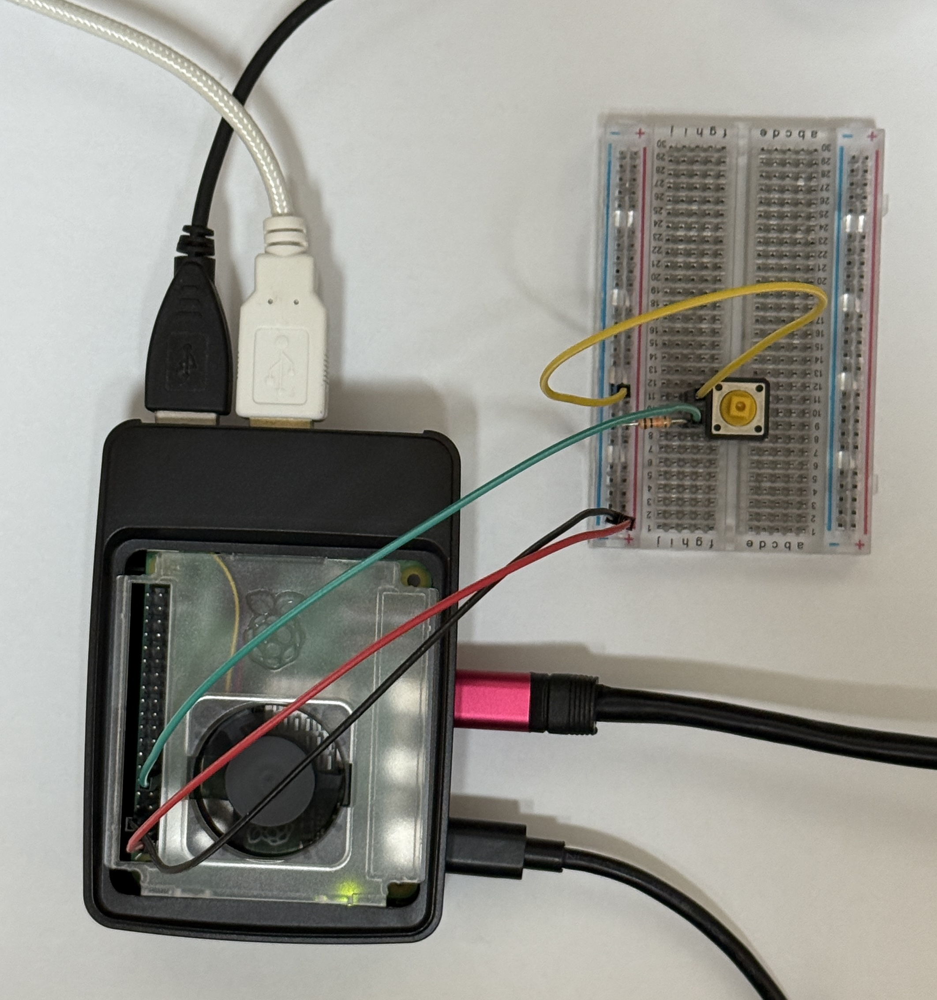
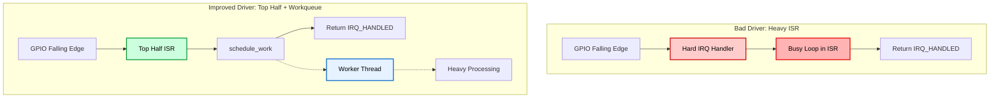

# 04. Interrupt Handling: Low-Latency Device Driver Design

## 📌 목표
리눅스 디바이스 드라이버가 인터럽트 처리를 Top Half와 Bottom Half로 분리하는 구조적 이유를 분석한다.

하드웨어 인터럽트가 발생하면 CPU는 현재 작업을 중단하고 인터럽트 서비스 루틴(ISR)에 진입한다. ISR에서 비용이 큰 작업을 직접 수행하면 하드 인터럽트 컨텍스트의 체류 시간이 늘어나고, 같은 CPU에서 처리할 다른 이벤트와 스케줄링에 지연을 초래할 수 있다.

본 실험은 Raspberry Pi 5에서 오래 걸리는 작업을 ISR에서 Workqueue 기반 지연 실행(Deferred execution) 경로로 이동했을 때 IRQ 핸들러 체류 시간이 얼마나 감소하는지 측정한다.

## 🛠️ 테스트 환경 & 타겟 워크로드
* **Hardware:** Raspberry Pi 5 Model B Rev 1.0
* **OS / Kernel:** Raspberry Pi OS, Linux `6.18.34+rpt-rpi-2712` (`aarch64`)
* **Interrupt Source:** custom Device Tree overlay (`irq.dtbo`)를 통해 등록된 GPIO 17 button input
  
* **Device Driver Variants:**
  * `bad_irq.ko`: ISR 내부에서 의도적으로 무거운 Busy loop를 실행하는 드라이버.
  * `workqueue_irq.ko`: 동일한 Busy loop를 리눅스 Workqueue를 통해 스케줄링하는 드라이버.
* **Observability Tool:** `irq:irq_handler_entry` 부터 `irq:irq_handler_exit` 까지의 소요 시간을 측정하는 BCC/eBPF tracepoint program.

## 🧪 실험 설계
동일한 Device Tree 호환 문자열 `kmwook,irq`에 바인딩되는 두 드라이버를 비교한다. 두 모듈은 같은 플랫폼 디바이스를 대상으로 하므로 각각 단독으로 로드하여 측정한다.

1. `bad_irq.ko`를 로드하고 IRQ 185가 ISR 내부에 머무는 시간 측정
2. `bad_irq.ko` 제거
3. `workqueue_irq.ko`를 로드하고 동일한 IRQ 재측정
4. 관측된 Top Half 실행 시간 비교

eBPF 추적 코드는 `irq_handler_entry`와 `irq_handler_exit` 사이만 측정한다. 따라서 하드 IRQ 핸들러의 실행 시간은 포함하지만, 지연된 Workqueue 작업의 시작·종료 시간은 포함하지 않는다.

## 📊 1. Baseline: ISR 내부에서의 무거운 처리 (`bad_irq`)
의도적으로 비효율적으로 설계한 구현에서는 IRQ 핸들러가 인터럽트 컨텍스트에서 긴 busy loop를 직접 실행한다.

```c
static irqreturn_t bad_irq_handler(int irq, void *dev_id)
{
    volatile unsigned long i;
    for (i = 0; i < busy_counter; i++)
        cpu_relax();

    return IRQ_HANDLED;
}
```

### 측정 결과
```text
IRQ Duration (ns)
118507067
118504325
118492011
164633734
118506046
118497045
```

물리 버튼을 4회 누른 동안 6개의 인터럽트 이벤트가 관측되었다. 기계식 버튼의 접점 바운스(Contact bounce)가 복수의 하강 에지(Falling edge)를 발생시킨 결과로 해석한다.

| Sample | IRQ Handler Duration |
| :---: | :---: |
| 1 | 118.51 ms |
| 2 | 118.50 ms |
| 3 | 118.49 ms |
| 4 | 164.63 ms |
| 5 | 118.51 ms |
| 6 | 118.50 ms |
| **Average** | **126.19 ms** |

### 분석
ISR은 118.49~164.63 ms 동안 실행되었으며, 평균은 126.19 ms이다. 이는 이벤트 확인과 상태 저장을 주목적으로 하는 Top Half에 과도하게 긴 시간이다.

이 기간에 해당 CPU는 정상적인 태스크 실행으로 복귀하지 못한다. 이러한 설계는 같은 CPU에서 처리될 다른 이벤트의 꼬리 지연을 증가시킬 위험이 있다.

## 📊 2. Deferred Work: Workqueue 기반 Bottom Half (`workqueue_irq`)
개선된 구현에서는 ISR이 작업을 스케줄링한 뒤 즉시 반환한다.

```c
static irqreturn_t workqueue_irq_handler(int irq, void *dev_id)
{
    struct workqueue_irq_dev *priv = dev_id;

    if (!schedule_work(&priv->work))
        pr_debug("work already pending\n");
    return IRQ_HANDLED;
}
```

동일한 busy loop는 프로세스 컨텍스트의 Workqueue에서 실행된다.

```c
static void work_handler(struct work_struct *work)
{
    volatile unsigned long i;
    for (i = 0; i < busy_counter; i++)
        cpu_relax();
}
```

### 측정 결과
```text
IRQ Duration (ns)
3333
5610
3463
352
1019
3871
1462
```

| Driver | Top Half Duration |
| :---: | :---: |
| `bad_irq.ko` average | 126.19 ms |
| `workqueue_irq.ko` average | 2.73 us |

| Sample | IRQ Handler Duration |
| :---: | :---: |
| 1 | 3.333 us |
| 2 | 5.610 us |
| 3 | 3.463 us |
| 4 | 0.352 us |
| 5 | 1.019 us |
| 6 | 3.871 us |
| 7 | 1.462 us |
| **Average** | **2.73 us** |

Workqueue 기반 설계의 관측된 IRQ 핸들러 평균 실행 시간은 `bad_irq` 대비 약 46,000분의 1로 감소한다.

## 🧠 아키텍처 분석: Workqueue가 결과를 바꾼 이유

```mermaid
graph TD
    subgraph "Bad Driver: Heavy ISR"
        A[GPIO Falling Edge] --> B[Hard IRQ Handler]
        B --> C[Busy Loop in ISR]
        C --> D[Return IRQ_HANDLED]

        style B fill:#ffcccc,stroke:#cc0000,stroke-width:2px,color:black
        style C fill:#ffb3b3,stroke:#e60000,stroke-width:2px,color:black
    end

    subgraph "Improved Driver: Top Half + Workqueue"
        E[GPIO Falling Edge] --> F[Top Half ISR]
        F --> G[schedule_work]
        G --> H[Return IRQ_HANDLED]
        G -.-> I[Worker Thread]
        I -.-> J[Heavy Processing]

        style F fill:#ccffdd,stroke:#009933,stroke-width:2px,color:black
        style I fill:#e6f2ff,stroke:#0066cc,stroke-width:2px,color:black
    end
```

### 1. The Problem: 긴 ISR 실행 시간
인터럽트 핸들러는 일반적인 커널 작업이 다수 제한되는 특수한 컨텍스트에서 실행된다. 따라서 하드웨어 이벤트를 인지하고 최소한의 상태를 저장한 뒤, 필요한 후속 작업을 스케줄링하고 빠르게 반환해야 한다.

그러나 `bad_irq` 드라이버는 ISR에서 비용이 큰 루프를 직접 실행한다. 그 결과 Top Half 실행 시간이 100 ms 이상으로 늘어난다.

또한 핸들러 실행 중에는 해당 IRQ 라인의 재진입과 일부 인터럽트 처리가 제한될 수 있어, 네트워크나 타이머 등 다른 이벤트의 처리 지연을 키울 수 있다. 정확한 마스크 범위는 인터럽트 컨트롤러와 핸들러 설정에 따라 달라진다.

### 2. The Solution: Deferred Work
`workqueue_irq` 드라이버는 비용이 큰 연산을 지연된 작업으로 전환한다.

ISR은 `schedule_work()`를 호출한 뒤 마이크로초 단위에서 반환하고, 나머지 느린 경로는 커널 워커 스레드에 위임한다.

이것이 Top Half/Bottom Half 분리의 핵심 원칙이다. 긴급한 경로는 짧게 유지하고, 나머지 처리는 필요한 기능을 제공하는 다른 실행 컨텍스트로 이동한다.

## 🔭 한계점 및 향후 과제
본 실험은 무거운 ISR과 Workqueue 기반 지연 설계의 Top Half 실행 시간 차이를 보였으나, 다음과 같은 한계를 갖는다.

1. **기계식 버튼의 접점 바운스 (Mechanical Button Bounce)**

   GPIO 17에 연결한 물리 버튼을 인터럽트 소스로 사용한다. 접점 바운스로 조작 횟수보다 IRQ 이벤트 수가 많았으므로, 후속 실험에서는 펄스 발생기나 하드웨어 디바운싱 회로로 신호를 통제할 필요가 있다.

2. **Top Half 측정의 한계**

   eBPF 프로그램은 `irq_handler_entry`와 `irq_handler_exit` 사이만 측정하므로 Workqueue 작업의 시작·종료는 포착하지 않는다. 후속 실험은 Workqueue 트레이스포인트나 `work_handler()` 타임스탬프를 추가하여 인터럽트 도달부터 작업 완료까지의 End-to-End 지연을 측정해야 한다.

3. **단일 GPIO 기반 시나리오**

   본 실험은 단순한 GPIO 인터럽트를 대상으로 한다. DMA 완료, 네트워크 RX/TX, 스토리지, 고주파수 센서 등 실제 드라이버 워크로드에서 같은 결과가 재현되는지 추가 검증이 필요하다.

4. **Workqueue가 유일한 정답은 아님**

   Workqueue는 프로세스 컨텍스트에서 실행되어 sleep이 가능하지만 모든 상황의 최적 해법은 아니다. 디바이스의 지연·처리량·실행 컨텍스트 요구사항에 따라 Workqueue, SoftIRQ, Threaded IRQ, NAPI 등을 비교해야 한다.

5. **실시간(Real-Time) 커널 튜닝**

   본 실험은 표준 Raspberry Pi OS 커널에서 수행한다. 엄격한 지연 보장을 평가하려면 PREEMPT_RT 커널, CPU 격리, IRQ 친화도, 스레드 우선순위를 변수로 추가 측정해야 한다.


## 💡 결론
본 실험은 ISR에서 비용이 큰 작업을 분리해야 하는 이유를 측정치로 보인다.

의도적으로 무겁게 설계한 ISR은 IRQ 핸들러에서 평균 126.19 ms를 소비한다. 같은 연산을 Workqueue로 이동하면 관측된 Top Half 평균은 2.73 μs로 감소한다. 이 결과는 전체 작업량이 사라졌음을 의미하지 않으며, 비용이 큰 연산이 하드 인터럽트 컨텍스트에서 워커 스레드로 이동했음을 의미한다.

지연 민감형 시스템의 드라이버는 Top Half를 짧게 유지하고 지연 가능한 작업을 적절한 Bottom Half로 이동해야 한다. 다만 최종 설계는 Top Half 시간뿐 아니라 End-to-End 지연, 처리량, 작업 병합 정책을 함께 평가해야 한다.

<details>
<summary><b>Terminal Output</b></summary>
<div markdown="1">

```text
kmwook@raspberrypi:~/kernel-deep-dive/04_driver_interrupt/irq_latency $ sudo python3 irq_latency.py 185
IRQ Duration (ns)
118507067
118504325
118492011
164633734
118506046
118497045
```

```text
kmwook@raspberrypi:~/kernel-deep-dive/04_driver_interrupt/irq_latency $ sudo python3 irq_latency.py 185
IRQ Duration (ns)
3333
5610
3463
352
1019
3871
1462
```

</div>
</details>
