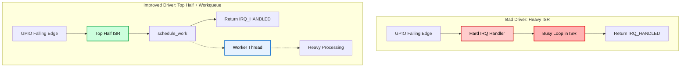

# 04. Interrupt Handling: Low-Latency Device Driver Design

## 📌 Objective
This step analyzes the structural reason why Linux device drivers separate interrupt handling into **Top Half** and **Bottom Half**.

When a hardware interrupt occurs, the CPU immediately stops the currently running task and enters the Interrupt Service Routine (ISR). If the ISR performs heavy processing directly, it monopolizes hard interrupt context for too long, delaying other interrupts and potentially destabilizing the entire system.

The objective of this experiment is to verify, with real measurements on Raspberry Pi 5 hardware, that moving long-running work out of the ISR and into a **Workqueue-based deferred execution path** dramatically reduces the time spent inside the interrupt handler.

## 🛠️ Test Environment & Target Workload
* **Hardware:** Raspberry Pi 5 Model B Rev 1.0
* **OS / Kernel:** Raspberry Pi OS, Linux `6.18.34+rpt-rpi-2712` (`aarch64`)
* **Interrupt Source:** GPIO 17 button input, registered through a custom Device Tree overlay (`irq.dtbo`)
* **Device Driver Variants:**
  * `bad_irq.ko`: intentionally performs a busy loop directly inside the ISR.
  * `workqueue_irq.ko`: schedules the same busy loop through a Linux Workqueue.
* **Observability Tool:** BCC/eBPF tracepoint program measuring the duration between `irq:irq_handler_entry` and `irq:irq_handler_exit`.

## 🧪 Experiment Design
The experiment compares two drivers bound to the same Device Tree compatible string, `kmwook,irq`.

Because both modules target the same platform device, only one module is loaded at a time:

1. Load `bad_irq.ko` and measure how long IRQ 185 stays inside the ISR.
2. Remove `bad_irq.ko`.
3. Load `workqueue_irq.ko` and measure the same IRQ again.
4. Compare the measured Top Half execution time.

The eBPF tracing code does not measure the total completion time of the deferred work. It specifically measures the duration of the hard IRQ handler itself, which is the critical path that must remain short in low-latency driver design.

## 📊 1. Baseline: Heavy Processing Inside the ISR (`bad_irq`)
In the intentionally bad implementation, the IRQ handler executes a large busy loop directly in interrupt context:

```c
static irqreturn_t bad_irq_handler(int irq, void *dev_id)
{
    volatile unsigned long i;
    for (i = 0; i < busy_counter; i++)
        cpu_relax();

    return IRQ_HANDLED;
}
```

### Measurement Result
```text
IRQ Duration (ns)
118507067
118504325
118492011
164633734
118506046
118497045
```

Although the physical button was pressed four times, six interrupt events were observed. This is expected with a mechanical button because contact bounce can generate multiple falling edges.

| Sample | IRQ Handler Duration |
| :---: | :---: |
| 1 | 118.51 ms |
| 2 | 118.50 ms |
| 3 | 118.49 ms |
| 4 | 164.63 ms |
| 5 | 118.51 ms |
| 6 | 118.50 ms |
| **Average** | **126.19 ms** |

### Analysis
The ISR remained active for roughly **118 ms to 165 ms**. This is extremely long for hard interrupt context.

During this time, the CPU is occupied by the interrupt handler instead of quickly acknowledging the event and returning to normal scheduling. In real hardware systems, this kind of design can delay other interrupts, inflate tail latency, and increase the risk of system-wide instability under interrupt storms.

## 📊 2. Deferred Work: Workqueue-Based Bottom Half (`workqueue_irq`)
In the improved implementation, the ISR only schedules work and returns immediately:

```c
static irqreturn_t workqueue_irq_handler(int irq, void *dev_id)
{
    struct workqueue_irq_dev *priv = dev_id;

    if (!schedule_work(&priv->work))
        pr_debug("work already pending\n");
    return IRQ_HANDLED;
}
```

The heavy busy loop still exists, but it runs later in process context through the Workqueue:

```c
static void work_handler(struct work_struct *work)
{
    volatile unsigned long i;
    for (i = 0; i < busy_counter; i++)
        cpu_relax();
}
```

### Measurement Result
```text
IRQ Duration (ns)
3333
5610
3463
352
1019
3871
1462
```

| Driver | Top Half Duration |
| :---: | :---: |
| `bad_irq.ko` average | 126.19 ms |
| `workqueue_irq.ko` average | 2.73 us |

| Sample | IRQ Handler Duration |
| :---: | :---: |
| 1 | 3.333 us |
| 2 | 5.610 us |
| 3 | 3.463 us |
| 4 | 0.352 us |
| 5 | 1.019 us |
| 6 | 3.871 us |
| 7 | 1.462 us |
| **Average** | **2.73 us** |

The workqueue-based design reduced the measured IRQ handler duration by approximately **46,000x** compared with the average `bad_irq` result.

## 🧠 Architecture Analysis: Why Workqueue Changes the Result


### 1. The Problem: Long ISR Execution
An interrupt handler runs in a special context where many normal kernel operations are restricted. It should acknowledge the hardware event, save minimal state, schedule follow-up work if necessary, and return as quickly as possible.

The `bad_irq` driver violates this rule by running the expensive loop directly inside the ISR. As the measurement shows, this stretched the Top Half duration into the **hundreds of milliseconds** range.

Furthermore, while the ISR runs, local interrupts on that CPU core are disabled, meaning critical hardware events—such as network packets or timer ticks—can be dropped or severely delayed.

### 2. The Solution: Deferred Work
The `workqueue_irq` driver converts the heavy operation into deferred work.

The ISR no longer performs the expensive operation itself. Instead, it calls `schedule_work()`, returns after a few microseconds, and lets a kernel worker thread handle the slow path later.

This is the core design principle of Top Half / Bottom Half interrupt handling: keep the urgent path short, then move non-urgent processing into a safer execution context.

## 🔭 Limitations & Future Research
This experiment successfully demonstrated the difference between a heavy ISR and a Workqueue-based deferred design, but several limitations remain.

1. **Mechanical Button Bounce**

   The interrupt source was a physical button connected to GPIO 17. Because mechanical switches can generate multiple falling edges from a single press, the number of observed IRQ events was larger than the number of physical button presses. This is acceptable for proving the architectural difference, but future experiments should use a cleaner signal source such as a GPIO pulse generator, microcontroller, or hardware debouncing circuit.

2. **Top Half Measurement Only**

   The current eBPF program measures only the duration between `irq_handler_entry` and `irq_handler_exit`. Therefore, it captures how long the ISR runs, but it does not measure when the deferred Workqueue task actually starts or finishes. A future version should trace Workqueue events or add kernel timestamps inside `work_handler()` to measure end-to-end latency from interrupt arrival to deferred work completion.

3. **Single GPIO-Based Scenario**

   This experiment used a simple GPIO interrupt. Real production drivers often handle DMA completion, network RX/TX events, storage interrupts, or high-frequency sensor streams. Future research should repeat the same Top Half / Bottom Half comparison under higher interrupt rates and with more realistic hardware workloads.

4. **Workqueue Is Not Always the Only Answer**

   Workqueues are useful because they run in process context and can sleep, but they are not always the lowest-latency Bottom Half mechanism. Future experiments should compare Workqueue, Tasklet, SoftIRQ, threaded IRQ, and NAPI-style polling to understand which design is appropriate for each device class.

5. **Real-Time Kernel Tuning**

   This experiment was performed on a standard Raspberry Pi OS kernel. For stricter latency guarantees, future research should evaluate the same driver design on a PREEMPT_RT kernel, then measure how CPU isolation, IRQ affinity, thread priorities, and scheduler policy affect both ISR latency and deferred work latency.

## 💡 Engineering Conclusion
This experiment successfully verified why Linux device drivers should avoid doing heavy work inside interrupt handlers.

The intentionally bad ISR design held the CPU inside the IRQ handler for an average of **126.19 ms**, while the Workqueue-based design reduced the measured Top Half duration to an average of only **2.73 us**. The work did not disappear; it was moved out of hard interrupt context and into a worker thread where it can be handled without blocking the critical interrupt path.

For high-availability and real-time-oriented systems, this distinction is essential. A driver that appears functionally correct can still be architecturally dangerous if it performs long-running operations in the ISR. By designing drivers around a short Top Half and a deferred Bottom Half, we can reduce interrupt latency, improve system responsiveness, and build a safer foundation for hardware-facing Linux systems.

<details>
<summary><b>Terminal Output</b></summary>
<div markdown="1">

```text
kmwook@raspberrypi:~/kernel-deep-dive/04_driver_interrupt/irq_latency $ sudo python3 irq_latency.py 185
IRQ Duration (ns)
118507067
118504325
118492011
164633734
118506046
118497045
```

```text
kmwook@raspberrypi:~/kernel-deep-dive/04_driver_interrupt/irq_latency $ sudo python3 irq_latency.py 185
IRQ Duration (ns)
3333
5610
3463
352
1019
3871
1462
```

</div>
</details>
