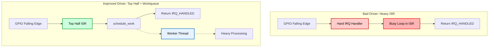

# 04. Interrupt Handling: Low-Latency Device Driver Design

## 📌 Objective
This experiment analyzes why Linux device drivers separate interrupt handling into a Top Half and Bottom Half.

When a hardware interrupt occurs, the CPU interrupts its current work and enters an interrupt service routine (ISR). Performing expensive work directly in the ISR increases time spent in hard-interrupt context and can delay other events and scheduling on the same CPU.

The experiment measures how moving long-running work from the ISR to a Workqueue-based deferred-execution path changes IRQ-handler residence time on a Raspberry Pi 5.

## 🛠️ Test Environment & Target Workload
* **Hardware:** Raspberry Pi 5 Model B Rev 1.0
* **OS / Kernel:** Raspberry Pi OS, Linux `6.18.34+rpt-rpi-2712` (`aarch64`)
* **Interrupt Source:** GPIO 17 button input, registered through a custom Device Tree overlay (`irq.dtbo`)

* **Device Driver Variants:**
  * `bad_irq.ko`: intentionally performs a busy loop directly inside the ISR.
  * `workqueue_irq.ko`: schedules the same busy loop through a Linux Workqueue.
* **Observability Tool:** BCC/eBPF tracepoint program measuring the duration between `irq:irq_handler_entry` and `irq:irq_handler_exit`.

## 🧪 Experiment Design
The experiment compares two drivers bound to the same Device Tree compatible string, `kmwook,irq`. Because both modules target the same platform device, they are loaded and measured separately:

1. Load `bad_irq.ko` and measure how long IRQ 185 stays inside the ISR.
2. Remove `bad_irq.ko`.
3. Load `workqueue_irq.ko` and measure the same IRQ again.
4. Compare the measured Top Half execution time.

The eBPF tracing code measures only the interval between `irq_handler_entry` and `irq_handler_exit`. It includes hard-IRQ handler execution but excludes the start and completion of deferred Workqueue processing.

## 📊 1. Baseline: Heavy Processing Inside the ISR (`bad_irq`)
In the intentionally inefficient implementation, the IRQ handler executes a long busy loop directly in interrupt context:

```c
static irqreturn_t bad_irq_handler(int irq, void *dev_id)
{
    volatile unsigned long i;
    for (i = 0; i < busy_counter; i++)
        cpu_relax();

    return IRQ_HANDLED;
}
```

### Measurement Result
```text
IRQ Duration (ns)
118507067
118504325
118492011
164633734
118506046
118497045
```

Six interrupt events were observed during four physical button presses. The result is attributed to contact bounce generating multiple falling edges.

| Sample | IRQ Handler Duration |
| :---: | :---: |
| 1 | 118.51 ms |
| 2 | 118.50 ms |
| 3 | 118.49 ms |
| 4 | 164.63 ms |
| 5 | 118.51 ms |
| 6 | 118.50 ms |
| **Average** | **126.19 ms** |

### Analysis
The ISR executes for 118.49–164.63 ms, with a mean of 126.19 ms. This is excessive for a Top Half intended primarily to acknowledge an event and save state.

During this interval, the CPU cannot return to normal task execution. Such a design risks increasing the tail latency of other events handled on the same CPU.

## 📊 2. Deferred Work: Workqueue-Based Bottom Half (`workqueue_irq`)
In the improved implementation, the ISR schedules work and then returns:

```c
static irqreturn_t workqueue_irq_handler(int irq, void *dev_id)
{
    struct workqueue_irq_dev *priv = dev_id;

    if (!schedule_work(&priv->work))
        pr_debug("work already pending\n");
    return IRQ_HANDLED;
}
```

The same busy loop executes in Workqueue process context:

```c
static void work_handler(struct work_struct *work)
{
    volatile unsigned long i;
    for (i = 0; i < busy_counter; i++)
        cpu_relax();
}
```

### Measurement Result
```text
IRQ Duration (ns)
3333
5610
3463
352
1019
3871
1462
```

| Driver | Top Half Duration |
| :---: | :---: |
| `bad_irq.ko` average | 126.19 ms |
| `workqueue_irq.ko` average | 2.73 us |

| Sample | IRQ Handler Duration |
| :---: | :---: |
| 1 | 3.333 us |
| 2 | 5.610 us |
| 3 | 3.463 us |
| 4 | 0.352 us |
| 5 | 1.019 us |
| 6 | 3.871 us |
| 7 | 1.462 us |
| **Average** | **2.73 us** |

The mean IRQ-handler duration of the Workqueue design is approximately 1/46,000 of the `bad_irq` result.

## 🧠 Architecture Analysis: Why Workqueue Changes the Result

```mermaid
graph TD
    subgraph "Bad Driver: Heavy ISR"
        A[GPIO Falling Edge] --> B[Hard IRQ Handler]
        B --> C[Busy Loop in ISR]
        C --> D[Return IRQ_HANDLED]

        style B fill:#ffcccc,stroke:#cc0000,stroke-width:2px,color:black
        style C fill:#ffb3b3,stroke:#e60000,stroke-width:2px,color:black
    end

    subgraph "Improved Driver: Top Half + Workqueue"
        E[GPIO Falling Edge] --> F[Top Half ISR]
        F --> G[schedule_work]
        G --> H[Return IRQ_HANDLED]
        G -.-> I[Worker Thread]
        I -.-> J[Heavy Processing]

        style F fill:#ccffdd,stroke:#009933,stroke-width:2px,color:black
        style I fill:#e6f2ff,stroke:#0066cc,stroke-width:2px,color:black
    end
```

### 1. The Problem: Long ISR Execution
An interrupt handler runs in a special context where many normal kernel operations are restricted. It should acknowledge the event, save minimal state, schedule any necessary follow-up work, and return quickly.

The `bad_irq` driver instead executes an expensive loop in the ISR, increasing Top Half duration beyond 100 ms.

While the handler runs, re-entry on that IRQ line and some interrupt handling may be restricted, increasing the latency of other events such as network and timer activity. The exact masking scope depends on the interrupt controller and handler configuration.

### 2. The Solution: Deferred Work
The `workqueue_irq` driver converts the expensive operation into deferred work.

The ISR calls `schedule_work()`, returns within microseconds, and delegates the slow path to a kernel worker thread.

This is the core Top Half/Bottom Half principle: keep the urgent path short and move the remaining work to an execution context that provides the required facilities.

## 🔭 Limitations & Future Research
The experiment demonstrates a difference in Top Half duration between a heavy ISR and a Workqueue-based design, subject to the following limitations.

1. **Mechanical Button Bounce**

   A physical button on GPIO 17 was used as the interrupt source. Contact bounce produced more IRQ events than button presses. A follow-up experiment should control the input with a pulse generator or hardware-debouncing circuit.

2. **Top Half Measurement Only**

   The eBPF program measures only the interval between `irq_handler_entry` and `irq_handler_exit`; it does not capture Workqueue start or completion. Workqueue tracepoints or timestamps in `work_handler()` are required to measure end-to-end latency from interrupt arrival to work completion.

3. **Single GPIO-Based Scenario**

   The experiment uses a simple GPIO interrupt. The result should be reproduced with realistic driver workloads such as DMA completion, network RX/TX, storage, or high-frequency sensor events.

4. **Workqueue Is Not the Only Mechanism**

   Workqueues execute in process context and may sleep, but they are not optimal for every workload. Workqueue, SoftIRQ, threaded IRQ, and NAPI should be compared according to device latency, throughput, and execution-context requirements.

5. **Real-Time Kernel Tuning**

   The experiment uses a standard Raspberry Pi OS kernel. Evaluating strict latency guarantees requires additional measurements with a PREEMPT_RT kernel, CPU isolation, IRQ affinity, and thread priority as variables.

## 💡 Conclusion
The measurements demonstrate why expensive work should be separated from an ISR.

The intentionally heavy ISR consumes a mean of 126.19 ms in the IRQ handler. Moving the same computation to a Workqueue reduces the observed Top Half mean to 2.73 μs. The workload is not eliminated; the expensive computation moves from hard-interrupt context to a worker thread.

Drivers for latency-sensitive systems should keep the Top Half short and move deferrable work to an appropriate Bottom Half. A final design must evaluate end-to-end latency, throughput, and work-coalescing policy in addition to Top Half duration.

<details>
<summary><b>Terminal Output</b></summary>
<div markdown="1">

```text
kmwook@raspberrypi:~/kernel-deep-dive/04_driver_interrupt/irq_latency $ sudo python3 irq_latency.py 185
IRQ Duration (ns)
118507067
118504325
118492011
164633734
118506046
118497045
```

```text
kmwook@raspberrypi:~/kernel-deep-dive/04_driver_interrupt/irq_latency $ sudo python3 irq_latency.py 185
IRQ Duration (ns)
3333
5610
3463
352
1019
3871
1462
```

</div>
</details>
